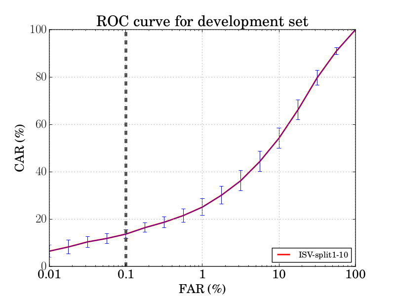

.. vim: set fileencoding=utf-8 :
.. @author: Manuel Gunther <mgunther@vast.uccs.edu>
.. @date:   Fri Sep 11 14:53:52 MDT 2015

==============
 User's Guide
==============


The Database Interface
----------------------

The :py:class:`bob.db.ijba.Database` complies with the standard biometric verification database as described in `bob.db.base <bob.db.base>`, implementing the interface :py:class:`bob.db.base.SQLiteDatabase`.


How to build the database?
--------------------------

  To build and download the database run the following command (go for a long coffee after is recommended!!):


.. code-block:: bash

    bob_dbmanage.py ijba download #The database file is too big, so it is not possible to upload on pypi


The Database Protocols
----------------------

In total we provide 20 evaluation protocols, the first 10 represents the search protocols and the last 10 are the comparison protocols (one for each split).


Search protocols
================


The search protocol measures the accuracy of open-set and closed-set search on the gallery templates using probe templates. 
To prevent an algorithm from leveraging apriori knowledge that every probe subject contains a mate in the gallery, 55 randomly selected subjects in each split have templates/imagery removed from the gallery set. 
Every probe template in a given split (regardless of whether or not the gallery contains the probe’s mated templates) are to be searched against the set of gallery templates. **ADD REF**.

The clients of a split as split in two groups called ```world``` and ```dev```.
With that division the defined protocols are called ```search_splitN``` with ```N=[1-10]```.

To fetch the object files using some protocol (let's say the first split), use the following piece of code:

.. code-block:: python

   >>> import bob.db.ijba
   >>> db = bob.db.ijba.Database()   
   >>> #Training set
   >>> train      = db.objects(protocol='search_split1', groups='world')   
   >>>
   >>> # Fetching the gallery of the development set
   >>> dev_enroll = db.objects(protocol='search_split1', groups='dev', purposes="enroll")
   >>> # Fetching the probes of the development set
   >>> dev_probe = db.objects(protocol='search_split1', groups='dev', purposes="probe")
   >>> 


Comparison protocols
====================

The compare protocol measures the verification accuracy.
In a similar manner as previous benchmarks, the protocol specifies precisely which genuine and impostor comparisons should be performed for
each split. 
For a given split, the number of genuine comparisons will be equal to the number of probe templates, as a single gallery template exists for each subject. 
The number of impostor comparisons is set to 10,000. 
The impostor comparisons are randomly sampled between probe templates and non-mated gallery templates under the following restriction: the two subjects represented in the gallery and probe templates have the same gender, and their skin color differs by no more than one of the six possible levels **ADD REF**.


The clients of a split as split in two groups called ```world``` and ```dev```.
With that division the defined protocols are called ```compare_splitN``` with ```N=[1-10]```.

To fetch the object files using some protocol (let's say the first split), use the following piece of code:

.. code-block:: python

   >>> import bob.db.ijba
   >>> db = bob.db.ijba.Database()   
   >>> #Training set
   >>> train      = db.objects(protocol='compare_split1', groups='world')   
   >>>
   >>> # Fetching the gallery for the template '226'
   >>> dev_enroll = db.objects(protocol='compare_split1', groups='dev', purposes="enroll", model_ids=["226"])
   >>> # Fetching the probes for the template '226'
   >>> dev_probe = db.objects(protocol='compare_split1', groups='dev', purposes="probe", model_ids=["226"])
   >>> 

.. warning::  
  
  As mentioned in the beginning of this subsection, each template has their own probes.
  Hence, it is mandatory to set the keyword ```model_ids``` when fetch files from this protocol.


NIST Score Generation
=====================

NIST has a specific file format to encode the scores of the comparisons.
This package contains a feature to convert the Bob 4 column format (`bob.bio.base.score.load.four_column`) to the NIST format. 
To do so, run the following command:

.. code-block:: bash

    score_generation.py <input-score-file> <output-score-file> [--template-size=<n>]


NIST specific plots
-------------------

Both protocols, search and comparison, are divided in 10 splits and the error rates should be measured as the average along the splits.
Type the following code to have more information on how to generate these plots.

.. code-block:: bash

  evaluate_ijba.py --help


The image bellow is the averege CMC curve, for the search protocol, with its standard deviation along the 10 splits:


The image bellow is the averege ROC curve, for the comparison protocol, with its standard deviation along the 10 splits:




.. _bob: https://www.idiap.ch/software/bob
